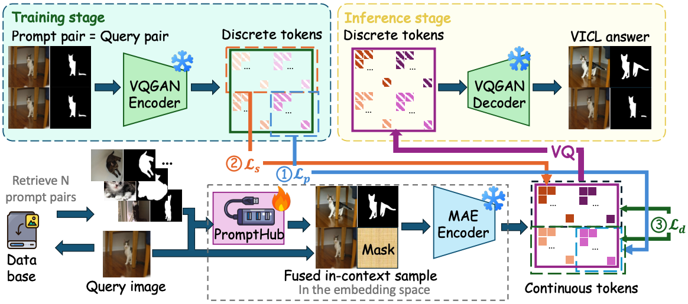
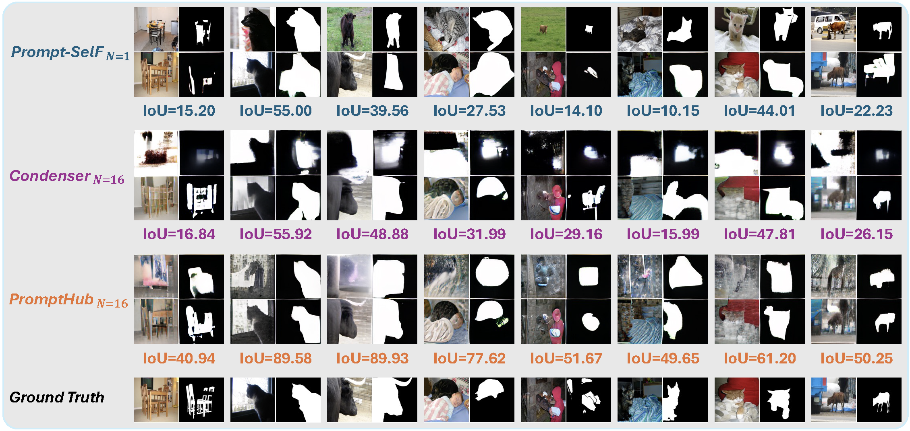

# PromptHub: Enhancing Multi-Prompt Visual In-Context Learning with Locality-Aware Fusion, Concentration and Alignment


## 1. Introduction

This is the implementation of our work at **ICLR2026**😊:

> [**PromptHub: Enhancing Multi-Prompt Visual In-Context Learning with Locality-Aware Fusion, Concentration and Alignment**](https://openreview.net/pdf?id=FBbO5I40VZ). Tianci Luo<sup>\*</sup>, Jinpeng Wang<sup>*</sup>, Shiyu Qin, Niu Lian, Yan Feng, Bin Chen, Chun Yuan, Shu-Tao Xia.



We introduce **PromptHub**, a locality-aware prompt fusion framework for Visual In-Context Learning. Building on our previous work, **CONDENSER**, **PromptHub** moves beyond rigid patch-wise fusion by exploiting spatial priors and jointly optimizing fusion, concentration, alignment, and prediction, enabling more reliable and effective multi-prompt integration.

## 2. Requirements

- Python 3.8
- PyTorch 1.12.1
- cuda 11.6

```
git clone https://github.com/luotc-why/ICLR26-PromptHub.git
cd ICLR26-PromptHub
conda create -n prompthub python=3.8 -y
conda activate prompthub
conda install pytorch==1.12.1 torchvision==0.13.1 torchaudio==0.12.1 cudatoolkit=11.6 -c pytorch -c conda-forge
pip install -r requirements.txt
```

## 3. Preparing Datasets and Downloading Pre-Trained MAE-VQGAN Weights

**The preparation of these components follows exactly the same procedure as in CONDENSER.**

### 3.1 Preparing Datasets

Download following datasets:

> #### 1. PASCAL-5<sup>i</sup>
> Download PASCAL VOC2012 devkit (train/val data).

> #### 2. COCO-20<sup>i</sup>
> Download COCO2014 train/val images and annotations.

> #### 3. ImageNet
> Download ImageNet-1K ILSVRC2012 train/val images and annotations.

Create a directory '../Datasets_PromptHub' for the above three datasets and appropriately place each dataset to have following directory structure:

    PromptHub/                         # parent directory
    ├── ICLR26-PromptHub/              # current (project) directory
    └── Datasets_PromptHub/
        ├── pascal-5i/VOC2012            # PASCAL VOC2012 devkit
        │   ├── Annotations/
        │   ├── ImageSets/
        │   ├── ...
        │   └── SegmentationClassAug/
        ├── coco/           
        │   ├── train2014/
        │   └── val2014/  
        ├── imagenet/           # (dir.) contains 1000 object classes
        │   ├── test_data
        │   ├── test_label
        │   ├── train_data
        │   └── train_label   
        ├── split/coco/
        ├── splits/pascal/
        ├── output/
        │   ├── logs/
        │   └── visual_examples/   
        ├── save_ours_ckpt/
        ├── weights/
        │   ├── vqgan/
        │   ├─────── last.ckpt
        │   ├─────── model.yaml   
        │   └── visual_examples/   
        └── ckpt/

### 3.2 Downloading Pre-Trained MAE-VQGAN Weights
Please follow [Visual Prompting](https://github.com/amirbar/visual_prompting) to prepar model and download the ```CVF 1000 epochs``` pre-train checkpoint.

**We use the segmentation task as an example to illustrate the specific workflow.**

## 4. Prompt Retriever and Feature Preprocess

**The data preprocessing and retrieval procedures are also kept consistent with CONDENSER.**

First, we extract features at the pixel-level using CLIP's visual encoder, separately for val-set and train-set.
```
python ICLR26-PromptHub/tools/feature_extractor_folderwise_segmentation.py vit_large_patch14_clip_224.laion2b features_vit-laion2b_pixel-level val
python ICLR26-PromptHub/tools/feature_extractor_folderwise_segmentation.py vit_large_patch14_clip_224.laion2b features_vit-laion2b_pixel-level trn
```
Then, we calculate a similarity matrix using the features, and extract the top-50 similar prompt names.

```
python ICLR26-PromptHub/tools/calculate_similariity.py features_vit-laion2b_pixel-level val trn
python ICLR26-PromptHub/tools/calculate_similariity.py features_vit-laion2b_pixel-level trn trn
```
We aim to preprocess the features used as embeddings for visual prompts and queries.

```
python ICLR26-PromptHub/tools/calculate_pre_feature_for_query.py
python ICLR26-PromptHub/tools/calculate_pre_feature_for_support.py
```

## 5. Training and Inference

### 5.1 Training 

```
python3 ICLR26-PromptHub/train_vp_segmentation.py \
 --mode spimg_spmask \
 --output_dir Datasets_PromptHub/output/logs/ \
 --device cuda:0 \
 --base_dir Datasets_PromptHub/pascal-5i/ \
 --batch-size 16 \
 --lr 0.03 \
 --epoch 150 \
 --scheduler cosinewarm \
 --arr a1 \
 --vp-model Prompt \
 --p-eps 1 \
 --ckpt Datasets_PromptHub/weights/checkpoint-1000.pth \
 --vq_ckpt_dir Datasets_PromptHub/weights/vqgan \
 --save_base_dir Datasets_PromptHub/ \
 --simidx 16 \
 --dropout 0.25 \
 --sigma 0.65 \
 --choice Cut \
 --loss_mean 0 \
 --fold 3 \
 --lamba 0.5 \
 --gama 0.2 \
```

- `<fold>`: fold-id of pascal-5i and coco-5i
- `<simidx>`: number of prompt pairs

1. Replace train_vp_segmentation.py with train_vp_detection.py to train for single object detection.

2. Replace train_vp_segmentation.py with train_vp_coloring.py, then replace --base_dir Data/pascal-5i/ with --base_dir Data/imagenet/ to train for coloring.

3. Change the value of simidx to determine the number of prompt pairs used during training.

The logs, model checkpoints will be generated under the `Datasets_PromptHub/output/logs/` and `Datasets_PromptHub/save_ours_ckpt/` folders, respectively. 

### 5.2 Inference

We provide the evaluation code for model checkpoints (if exist). 
The test command is as follows:

```
python3 ICLR26-PromptHub/val_vp_segmentation.py \
 --fold 0 \
 --mode spimg_spmask \
 --output_dir Datasets_PromptHub/output/logs\
 --device cuda:0\
 --base_dir Datasets_PromptHub/pascal-5i/ \
 --batch-size 8 \
 --lr 0.03\
 --epoch 150\
 --arr a1\
 --vp-model Prompt\
 --p-eps 1\
 --ckpt Datasets_PromptHub/weights/checkpoint-1000.pth\
 --vq_ckpt_dir Datasets_PromptHub/weights/vqgan\
 --save_base_dir Datasets_PromptHub/\
 --simidx 1\
 --dropout 0.25\
 --sigma 0.65\
 --save_model_path Datasets_PromptHub/ckpt/Seg_K_1_Folder_0.pth
```

1. Replace val_vp_segmentation.py with val_vp_detection.py to inference for single object detection.

2. Replace val_vp_segmentation.py with val_vp_coloring.py, then replace --base_dir Datasets_PromptHub/pascal-5i/ with --base_dir Data/imagenet/ to inference for coloring.

3. Change the value of simidx to determine the number of prompt pairs used during inference.

To facilitate the readers' implementation of inference, we have also designed a simple bash script for inference. To run it, navigate to the root directory of PromptHub and execute the following command:

```
bash Codes/script/run01.sh
```

This will complete the relevant inference tasks.

### 5.3 Checkpoints and Results

Download the checkpoint to the `Datasets_PromptHub/ckpt` path. Run the corresponding `.sh` file to achieve one-click execution and directly obtain the results shown in the table.

<table class="tg"><thead>
  <tr>
    <th class="tg-nrix" rowspan="2">Task (Metric)</th>
    <th class="tg-nrix" colspan="2" rowspan="2">Dataset</th>
    <th class="tg-nrix" colspan="3">K=1</th>
    <th class="tg-nrix" colspan="3">K=16</th>
  </tr>
  <tr>
    <th class="tg-nrix">Score</th>
    <th class="tg-nrix">Checkpoint</th>
    <th class="tg-nrix">Script</th>
    <th class="tg-nrix">Score</th>
    <th class="tg-nrix">Checkpoint</th>
    <th class="tg-nrix">Script</th>
  </tr></thead>
<tbody>
  <tr>
    <td class="tg-nrix" rowspan="4">Segmentation (mIoU↑)</td>
    <td class="tg-nrix" rowspan="4">Pascal-5i</td>
    <td class="tg-nrix">Folder 0</td>
    <td class="tg-nrix">43.26</td>
    <td class="tg-nrix">  <a href="https://drive.google.com/file/d/1sjw06OODHlfZJ71vu_-D-rri1Fx2nJWf/view?usp=sharing" target="_blank">Seg_K_1_Fold_0.pth</a>
    </td>
    <td class="tg-nrix"><a href="./script/run01.sh">run01.sh</a></td>
    <td class="tg-nrix">45.93</td>
    <td class="tg-nrix">  <a href="https://drive.google.com/file/d/1wORJ8eZDttlifNZsrFjDIru0NkHxSSjl/view?usp=sharing" target="_blank">Seg_K_16_Fold_0.pth</a>
    <td class="tg-nrix"><a href="./script/run02.sh">run02.sh</a></td>
    </td>
  </tr>
  <tr>
    <td class="tg-nrix">Folder 1</td>
    <td class="tg-nrix">50.75</td>
    <td class="tg-nrix">  <a href="https://drive.google.com/file/d/1hhwec_NDKSbQ_tS-QcE9DIn6fARdY59K/view?usp=sharing" target="_blank">Seg_K_1_Fold_1.pth</a>
    </td>
    <td class="tg-nrix"><a href="./script/run03.sh">run03.sh</a></td>
    <td class="tg-nrix">53.12</td>
    <td class="tg-nrix">  <a href="https://drive.google.com/file/d/1ETSnzkUNJnBg_vVNinzUE6ChoQ7LmfZp/view?usp=sharing" target="_blank">Seg_K_16_Fold_1.pth</a>
    </td>
    <td class="tg-nrix"><a href="./script/run04.sh">run04.sh</a></td>
  </tr>
  <tr>
    <td class="tg-nrix">Folder 2</td>
    <td class="tg-nrix">43.83</td>
    <td class="tg-nrix">  <a href="https://drive.google.com/file/d/1A26pBubaby12TOSnTMt4PNvjUm3GeRj-/view?usp=sharing" target="_blank">Seg_K_1_Fold_2.pth</a>
    </td>
    <td class="tg-nrix"><a href="./script/run05.sh">run05.sh</a></td>
    <td class="tg-nrix">45.44</td>
    <td class="tg-nrix">  <a href="https://drive.google.com/file/d/12AoVH-4A24PMx0gf0DqMa3A1ueb8lgpw/view?usp=sharing" target="_blank">Seg_K_16_Fold_2.pth</a>
    </td>
    <td class="tg-nrix"><a href="./script/run06.sh">run06.sh</a></td>
  </tr>
  <tr>
    <td class="tg-nrix">Folder 3</td>
    <td class="tg-nrix">42.82</td>
    <td class="tg-nrix">  <a href="https://drive.google.com/file/d/1gflEUebnnQbc2wF3vRkqE958UtnMQwVZ/view?usp=sharing" target="_blank">Seg_K_1_Fold_3.pth</a>
    </td>
    <td class="tg-nrix"><a href="./script/run07.sh">run07.sh</a></td>
    <td class="tg-nrix">46.74</td>
    <td class="tg-nrix">  <a href="https://drive.google.com/file/d/1_4yxLhp23da8KxeQnTvB5_yeNRxfstjF/view?usp=sharing" target="_blank">Seg_K_16_Fold_3.pth</a>
    </td>
    <td class="tg-nrix"><a href="./script/run08.sh">run08.sh</a></td>
  </tr>
  <tr>
    <td class="tg-nrix">Detection (mIoU↑)</td>
    <td class="tg-nrix" colspan="2">Pascal VOC 2012</td>
    <td class="tg-nrix">44.51</td>
    <td class="tg-nrix">  <a href="https://drive.google.com/file/d/1TcsWcP5S5lt8MHga6dKBIG84antb_Csj/view?usp=sharing" target="_blank">Det_K_1.pth</a>
    </td>
    <td class="tg-nrix"><a href="./script/run09.sh">run09.sh</a></td>
    <td class="tg-nrix">45.59</td>
    <td class="tg-nrix">  <a href="https://drive.google.com/file/d/1n0fb5LPapQPNLcpjrWM0Y6Wv5GqFUx94/view?usp=sharing" target="_blank">Det_K_16.pth</a>
    </td>
    <td class="tg-nrix"><a href="./script/run10.sh">run10.sh</a></td>
  </tr>
</tbody></table>

We have also open-sourced the experiment logs and checkpoints for the domain adaptation experiments. The experiments were pre-trained on Coco-5i and tested on Pascal-5i.

<table class="tg"><thead>
  <tr>
    <th class="tg-nrix" rowspan="2">Task (Metric)</th>
    <th class="tg-nrix" colspan="2" rowspan="2">Dataset</th>
    <th class="tg-nrix" colspan="3">K=1</th>
    <th class="tg-nrix" colspan="3">K=16</th>
  </tr>
  <tr>
    <th class="tg-nrix">Score</th>
    <th class="tg-nrix">Checkpoint</th>
    <th class="tg-nrix">Script</th>
    <th class="tg-nrix">Score</th>
    <th class="tg-nrix">Checkpoint</th>
    <th class="tg-nrix">Script</th>
  </tr></thead>
<tbody>
  <tr>
    <td class="tg-nrix" rowspan="4">Segmentation (mIoU↑)</td>
    <td class="tg-nrix" rowspan="4">Coco-5i</td>
    <td class="tg-nrix">Folder 0</td>
    <td class="tg-nrix">40.36</td>
    <td class="tg-nrix">  <a href="https://drive.google.com/file/d/1peiUuLROhQI9zFoIzG19aPt3r6wkIK3N/view?usp=sharing" target="_blank">Coco_K_1_Fold_0.pth</a>
    </td>
    <td class="tg-nrix"><a href="./script/run13.sh">run13.sh</a></td>
    <td class="tg-nrix">42.69</td>
    <td class="tg-nrix">  <a href="https://drive.google.com/file/d/1REuuawe2AhBD21UgTfYP78cSzPLzs77r/view?usp=sharing" target="_blank">Coco_K_16_Fold_0.pth</a>
    </td>
    <td class="tg-nrix"><a href="./script/run14.sh">run14.sh</a></td>
  </tr>
  <tr>
    <td class="tg-nrix">Folder 1</td>
    <td class="tg-nrix">45.24</td>
    <td class="tg-nrix">  <a href="https://drive.google.com/file/d/1GOX5Gek7sNZUc1hSqPPl_U4O4PgGQnV5/view?usp=sharing" target="_blank">Coco_K_1_Fold_1.pth</a>
    </td>
    <td class="tg-nrix"><a href="./script/run15.sh">run15.sh</a></td>
    <td class="tg-nrix">46.71</td>
    <td class="tg-nrix">  <a href="https://drive.google.com/file/d/1EhnkM-LbW9Nf_Vf6TFErsMILoA0V92L9/view?usp=sharing" target="_blank">Coco_K_16_Fold_1.pth</a>
    </td>
    <td class="tg-nrix"><a href="./script/run16.sh">run16.sh</a></td>
  </tr>
  <tr>
    <td class="tg-nrix">Folder 2</td>
    <td class="tg-nrix">40.43</td>
    <td class="tg-nrix">  <a href="https://drive.google.com/file/d/1WxCP4Zv2qdYaKMWv7HXib4SLhhhiJwhy/view?usp=sharing" target="_blank">Coco_K_1_Fold_2.pth</a>
    </td>
    <td class="tg-nrix"><a href="./script/run17.sh">run17.sh</a></td>
    <td class="tg-nrix">41.97</td>
    <td class="tg-nrix">  <a href="https://drive.google.com/file/d/1480zTWZQn6LiVK-H2XR3xQU6vWY5Xq56/view?usp=sharing" target="_blank">Coco_K_16_Fold_2.pth</a>
    </td>
    <td class="tg-nrix"><a href="./script/run18.sh">run18.sh</a></td>
  </tr>
  <tr>
    <td class="tg-nrix">Folder 3</td>
    <td class="tg-nrix">37.94</td>
    <td class="tg-nrix">  <a href="https://drive.google.com/file/d/12vKE847OPZPeoWdTMLzmxlAHVK8R9W2Y/view?usp=sharing" target="_blank">Coco_K_1_Fold_3.pth</a>
    </td>
    <td class="tg-nrix"><a href="./script/run19.sh">run19.sh</a></td>
    <td class="tg-nrix">37.31</td>
    <td class="tg-nrix">  <a href="https://drive.google.com/file/d/1FNE1u_kctSB9wjiHA51UdZEPr9ca0NpP/view?usp=sharing" target="_blank">Coco_K_16_Fold_3.pth</a>
    </td>
    <td class="tg-nrix"><a href="./script/run20.sh">run20.sh</a></td>
  </tr>
</tbody></table>

## 6. Understanding of What PromptHub Learns
The visualization of the fused prompt pair and output after passing  through the VQGAN decoder.


## 7. References

If you find our code useful or use the toolkit in your work, please consider citing:

```
@inproceedings{
  luo2026prompthub,
  title={PromptHub: Enhancing Multi-Prompt Visual In-Context Learning with Locality-Aware Fusion, Concentration and Alignment},
  author={Tianci Luo and Jinpeng Wang and Shiyu Qin and Niu Lian and Yan Feng and Bin Chen and Chun Yuan and Shu-Tao Xia},
  booktitle={The Fourteenth International Conference on Learning Representations},
  year={2026},
  url={https://openreview.net/forum?id=FBbO5I40VZ}
}
```

## 8. Acknowledgments

We are also grateful for other teams for open-sourcing codes that inspire our work, including [Visual Prompting](https://github.com/amirbar/visual_prompting), [visual_prompt_retrieval](https://github.com/ZhangYuanhan-AI/visual_prompt_retrieval), [timm](https://github.com/huggingface/pytorch-image-models), [ILM-VP](https://github.com/OPTML-Group/ILM-VP), [InMeMo](https://github.com/Jackieam/InMeMo).

## 9. Contact

If you have any question, you can raise an issue or email Tianci Luo (ltc25@mails.tsinghua.edu.cn). We will reply you soon.
